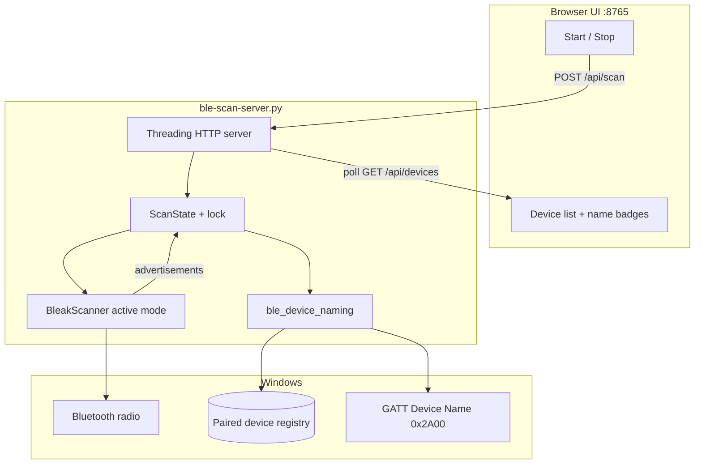
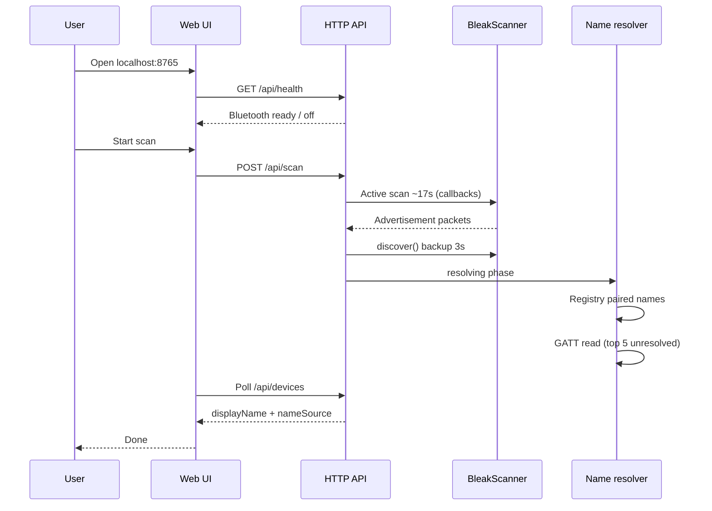
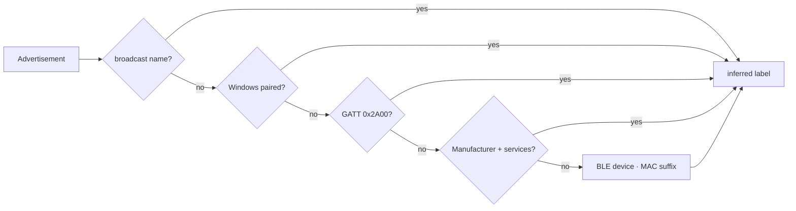
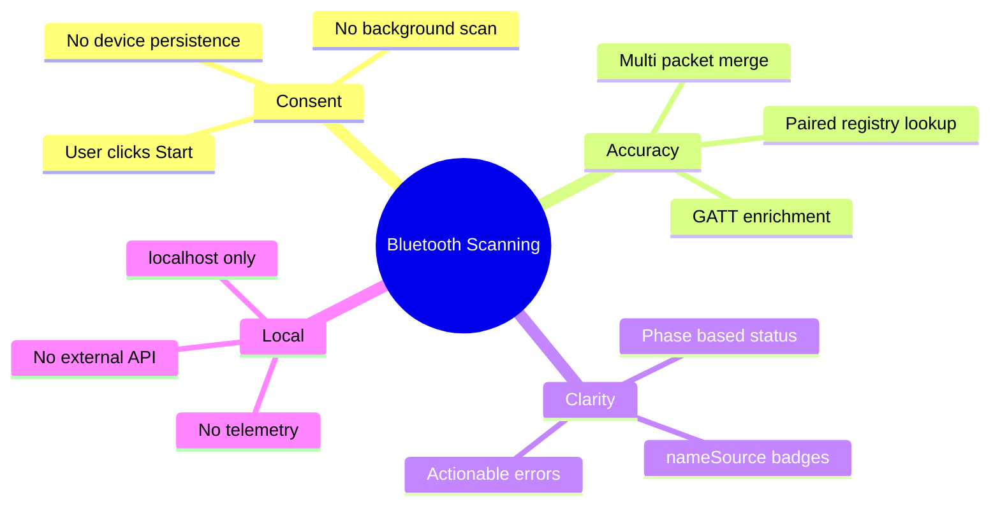

<div align="center">

# Bluetooth Scanning

**Native Windows BLE discovery with intelligent device naming — no browser flags, no background tracking.**

[](requirements.txt)
[](#)
[](#)
[](#license)

[Quick Start](#quick-start) · [Architecture](#architecture) · [Naming Pipeline](#naming-pipeline) · [API](#api) · [Troubleshooting](#troubleshooting)

</div>

---

## Overview

**Bluetooth Scanning** is a consent-based, local-first BLE scanner for Windows. It discovers nearby Low Energy devices through the OS Bluetooth stack (via [bleak](https://github.com/hbldh/bleak)), resolves human-readable names from multiple sources, and serves a live dashboard at `http://127.0.0.1:8765`.

| | |
|---|---|
| **Scan model** | User clicks Start — no passive background enumeration |
| **Naming** | Broadcast → paired registry → GATT → inference → MAC suffix |
| **Stack** | Python · bleak · WinRT · optional TypeScript client |
| **Privacy** | Runs on localhost; no cloud, no persistence, no tracking |

---

## Architecture



---

## Scan workflow



---

## Naming pipeline

Many BLE devices never broadcast a name. This project resolves **display names** in strict priority order:



| Priority | Source | Example | Badge |
|:---:|:---|:---|:---|
| 1 | **broadcast** | `Galaxy Buds` | `advertised` |
| 2 | **paired** | `Pixel 9` (Windows registry) | `paired` |
| 3 | **gatt** | Read from Device Name characteristic | `GATT name` |
| 4 | **inferred** | `Apple · Battery + HID` | `inferred` |
| 5 | **address** | `BLE device · A4:93:C6` | `address only` |

---

## Quick start

### Prerequisites

- **Windows 10/11** with Bluetooth adapter
- **Python 3.10+**
- Bluetooth **ON**
- Windows **Location** enabled (required for BLE scan on many builds)

### Install & run

```bash
git clone https://github.com/shep95/bluetooth-scanning.git
cd bluetooth-scanning
pip install -r requirements.txt
python ble-scan-server.py
```

Open **http://127.0.0.1:8765** → wait for the green health banner → click **Start scan**.

### TypeScript client (optional)

```typescript
import { BluetoothClient } from "./bluetooth-client";

const client = new BluetoothClient();
const health = await client.checkHealth();
if (!health.ready) throw new Error(health.message);

const scan = await client.startScan({
  onUpdate: (s) => console.log(s.phase, s.devices),
});

await new Promise((r) => setTimeout(r, 20_000));
await scan.stop();
```

---

## Project layout

```
bluetooth-scanning/
├── ble-scan-server.py      # HTTP server + scan orchestration + embedded UI
├── ble_device_naming.py    # Multi-source name resolution
├── bluetooth-client.ts     # TypeScript API client
├── requirements.txt
└── README.md
```

---

## API

| Method | Path | Description |
|:---:|:---|:---|
| `GET` | `/` | Web dashboard |
| `GET` | `/api/health` | Preflight Bluetooth radio check |
| `GET` | `/api/devices` | Scan snapshot (`phase`, `devices`, `count`) |
| `POST` | `/api/scan` | Start scan (503 if Bluetooth off) |
| `POST` | `/api/stop` | Stop scan early |

### Device object

```json
{
  "id": "C0:1C:6A:A4:93:C6",
  "displayName": "Pixel 9",
  "nameSource": "paired",
  "broadcastName": null,
  "manufacturer": "Google",
  "rssi": -62,
  "uuids": ["0000180f-0000-1000-8000-00805f9b34fb"]
}
```

### Scan phases

| Phase | Meaning |
|:---|:---|
| `idle` | Ready for new scan |
| `running` | Collecting advertisements |
| `resolving` | GATT + final name merge |
| `completed` | Results final |
| `failed` | Bluetooth or scan error |

---

## Troubleshooting

<details>
<summary><strong>Health check says Bluetooth is OFF</strong></summary>

Settings → **Bluetooth & devices** → turn Bluetooth **On**, then refresh the page.
</details>

<details>
<summary><strong>Scan completes with 0 devices</strong></summary>

1. Confirm health banner is green  
2. Enable **Location** in Windows Settings → Privacy  
3. Ensure a BLE device is nearby and advertising (phone, watch, headphones)  
4. Stay within ~10 m of the device
</details>

<details>
<summary><strong>Devices show inferred names instead of real names</strong></summary>

That device is not broadcasting its name and is not paired with this PC. Pair it in Windows Bluetooth settings, or rely on GATT resolution (automatic for the strongest unresolved devices).
</details>

<details>
<summary><strong>Port 8765 already in use</strong></summary>

```bash
# Windows PowerShell
Get-NetTCPConnection -LocalPort 8765 | ForEach-Object { Stop-Process -Id $_.OwningProcess -Force }
```
</details>

---

## Design principles



---

## License

MIT — see [LICENSE](LICENSE).

---

<div align="center">

**[shep95/bluetooth-scanning](https://github.com/shep95/bluetooth-scanning)**

Built for Windows BLE discovery with honest naming — not fake "unnamed" placeholders.

</div>
